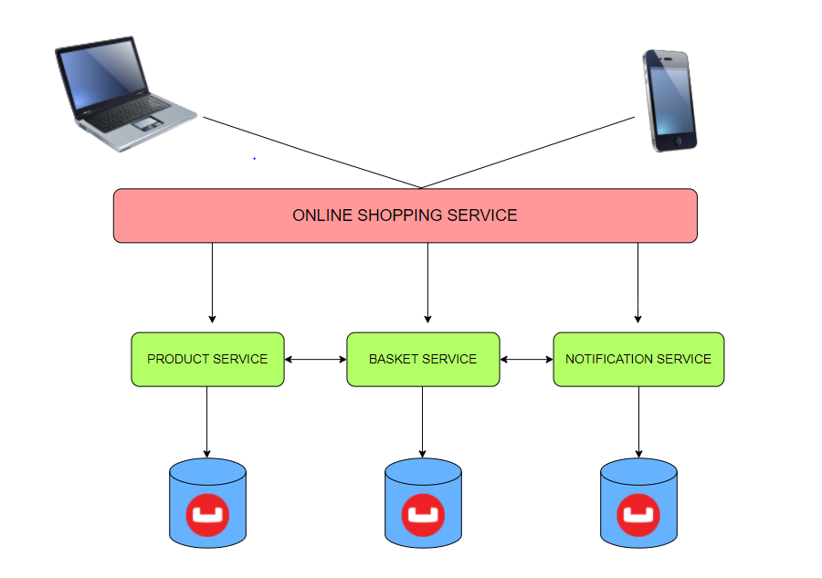

## **DESCRIPTION**

**This microservice is the third step of my individual project at the end of Trendyol Bootcamp.**

 **This service is responsible for notification processes within the basket domain I have set up. RestApi is written over port 9093. From here, a request can be made for previously sent notifications or the entire database with the user id.**
 
 **The main purpose of this service is to send an e-mail to the users who have that item in their basket according to the stock or price update information coming from outside. Here, it is aimed to create an asynchronous structure by establishing the Kafka Consumer structure to listen to the changing stock and price information.** 
 
 **In order to easily add different email types that may occur later to the system, Factory Pattern has been applied to Email types. In order to send a real mail to users, a service that can be added as javax.mail dependency and send mail to users via gmail has been implemented. While sending these mails, Kafka service receives which User IDs it will send mail to by sending Http request to the basket service.** 
 
 **Couchbase is used as database in this service. The reason is to increase performance and scalability using NoSql.** 
 
 **Operations that mean business logic in Notification Service have been tested with Mockito using Unit Test. Notification Service's tests were done under TestNotification, Kafka Service's tests were under KafkaTest.**
 
  **The application is dockerized with the Dockerfile I wrote. A 3-step (build, package, test) pipeline was created during the Gitlab installation phase.**

